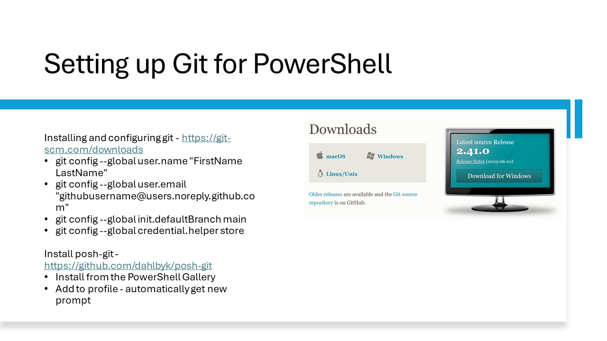

Download the latest version of Git for the platform you are using. There are versions for Windows,
macOS, and Linux. [https://git-scm.com/downloads](https://git-scm.com/downloads)

Before working with a repository you need to configure Git with your name and email address. You can
also set the default branch name and configure Git to store your credentials.

- `git config --global user.name "FirstName LastName"`
- `git config --global user.email "githubusername@users.noreply.github.com"`
- `git config --global init.defaultBranch main`
- `git config --global credential.helper store`

To integrate Git with PowerShell, install the **Posh-Git** module from the PowerShell Gallery.

```powershell
Install-Module -Name Posh-Git -Scope CurrentUser
```

After installing the module, you need to add it to your profile so that you automatically get the
new prompt.

## Related links

- [Posh-Git source repo](https://github.com/dahlbyk/posh-git)
